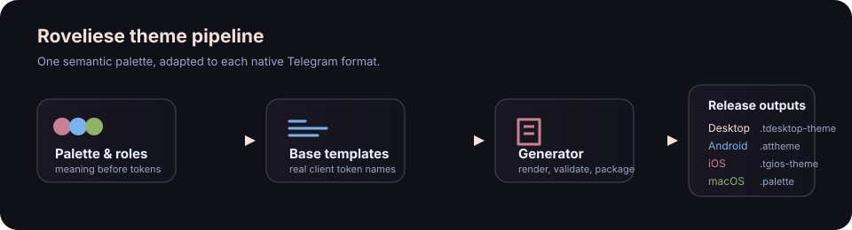

# Telegram platform theming reference

This is the maintenance reference for Roveliese's Telegram generator. It
summarizes the platform formats and the limits of Telegram's published
theming guidance. It is not a replacement for the local templates: Telegram
clients can add, ignore, or reinterpret tokens between releases.

## Source hierarchy

When a token's purpose or supported syntax is unclear, use sources in this
order:

1. Telegram's official themes documentation and the current native client.
2. The official client source/default theme for that platform, when available.
3. This repository's `templates/base/<polarity>/<platform>` and rendered
   `themes/` output.
4. Community references only as a lead to validate in the client; never treat
   an old token glossary as authoritative.

All public variants are built from `src/palette.js`, semantic roles, base
templates, and `scripts/build.js`. Never hand-edit `dist/` or `themes/`.
Platform formats are not interchangeable, even when a token sounds similar.

## Platform reference

| Platform | Release format | Authoring model | Important limits |
| --- | --- | --- | --- |
| Telegram Desktop | `.tdesktop-theme` | ZIP archive containing `colors.tdesktop-theme`, optionally a wallpaper | Richest documented token format; supports aliases and RGB/RGBA constants. |
| Android | `.attheme` | Flat `key=value` theme file; may contain a client-specific wallpaper payload | Advanced in-app editor exists, but token coverage changes with Android releases. |
| iOS | `.tgios-theme` | YAML document; this generator first renders flat keys, then nests them | The native editor is limited compared with Desktop/Android; no exhaustive official token glossary exists. |
| Telegram for macOS | `.palette` | Flat `key = value` file with metadata and variables | This is the separate native macOS client format, not Telegram Desktop running on a Mac. No exhaustive official token glossary exists. |

### Telegram Desktop

- The archive's color file is named `colors.tdesktop-theme`; a wallpaper, if
  included, is named `background.*` or `tiled.*`.
- A color can be a literal `#RRGGBB`/`#RRGGBBAA` value or an alias of another
  constant. Preserve aliases when they express a deliberate relationship;
  resolve them before measuring contrast.
- Use the in-app editor to identify a token, then encode the stable result in
  the base template and rebuild. Check media, replies/forwards, selected
  states, and the compact forwarding UI separately: their foreground tokens
  are not necessarily ordinary message text tokens.
- The community-maintained Desktop theme reference explains archive layout,
  alpha syntax, and aliases. The upstream `night.tdesktop-theme` is the best
  current baseline for newly introduced keys.

### Android

- Treat the file as an Android-specific key/value map. Do not transfer
  Telegram Desktop aliases or iOS YAML paths into it.
- Use the in-app editor to discover an element and retain every needed literal
  key in `templates/base/*/android`; Android's editor is the practical source
  of truth for current builds.
- Theme wallpaper serialization is client-specific. This project uses its
  generator/templates rather than manual binary-tail editing.
- Verify controls with foregrounds on fills (buttons, checkboxes, badges),
  incoming and outgoing bubbles, and the chat-list selected state.

### iOS

- The source template deliberately stays flat (`chat_message_…`); only
  `renderIosDocument` creates the nested YAML document. Add a token to the
  flat template and generator, never directly to the nested output.
- iOS provides a visual appearance editor and can import a theme, but it does
  not have the Desktop/Android-level public token reference. A missing token
  is a real coverage limit, not permission to invent a YAML key.
- Verify both wallpaper modes, incoming/outgoing/freeform bubbles, media
  overlays, switches, sheet menus, and selected/pressed states. Components
  such as peer-colour-driven previews may be rendered by the client without a
  dedicated theme token.

### Telegram for macOS

- Keep `.palette` syntax and metadata native to this client: `name`,
  `shortname`, `isDark`, `tinted`, `parent`, then `key = value` entries.
- Do not confuse it with Telegram Desktop on macOS. The latter imports the
  Desktop archive and must use the Desktop template instead.
- There is no complete public macOS key reference. Use the local base template
  as the curated supported-key catalogue, confirm unfamiliar keys in the
  native client, and retain unknown gaps rather than fabricating mappings.
- Review `basicAccent`, `accent`, selections, reply titles, links, waveform
  and file activity, semantic status colours, and message/media overlays.

## Shared workflow

1. Make a semantic decision in `src/palette.js` or `src/roles.js`; map it only
   to literal tokens that exist in the platform template.
2. Update `src/tokens.js` when a mapped role is important enough to audit.
   Name an unsupported platform capability in `KNOWN_GAPS` instead of creating
   a fictional token.
3. Build with `node scripts/build.js`; never edit generated release files by
   hand.
4. Run build check, integrity, legibility, background contrast, and token-role
   verification. Measure alpha after compositing onto the actual backdrop.
5. Import the relevant `dist/` file into the native client and inspect the
   concrete state that motivated the change. A passing static check cannot
   prove a client-only component is themeable.

Cloud themes and `t.me/addtheme` links are a publishing layer, not a source
format. Create or update them only through Telegram after the local artifact
has been tested; never add an unverified link to public documentation.

## External references

- [Telegram: Creating Custom Cloud Themes](https://core.telegram.org/themes)
  — official import, editor, publishing, and wallpaper workflow for all
  platforms.
- [Telegram Desktop Theme Reference](https://github-wiki-see.page/m/telegramdesktop/tdesktop/wiki/Theme-Reference)
  — detailed Desktop syntax and archive layout; useful but old, so validate
  new keys against current client behaviour.
- [Telegram Desktop built-in night theme](https://github.com/telegramdesktop/tdesktop/blob/dev/Telegram/Resources/night.tdesktop-theme)
  — current upstream reference for Desktop token names and defaults.
- [Telegram: Creating Android Themes](https://telegra.ph/Create-Theme-Android-FAQ)
  — official Android editor workflow.
- [Telegram: Theme Editor 2.0](https://telegram.org/blog/verifiable-apps-and-more?setln=en)
  — official editor and gradient/background capabilities.
